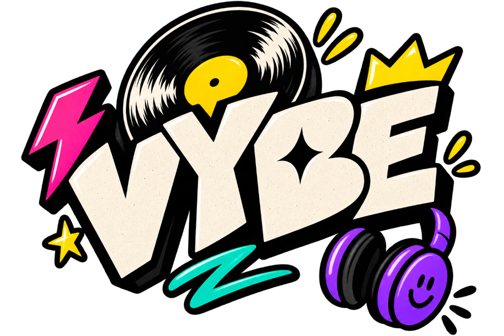

# VYBE ✦ Next-Generation Audio OS

<div align="center">



<br />


<br />

**Your Music. Your Vibe. Recalibrating how the next generation experiences sound.**

[Overview](#-overview) • [Core Features](#-core-features) • [Opening Experience](#-opening-splash-experience) • [Profile & Insights](#-profile-insights--gamification) • [Architecture](#-engineering-architecture) • [Getting Started](#-getting-started) • [API & Compliance](#-compliance--security)

</div>

---

## ⚡ Overview

**VYBE** is an autonomous music discovery engine and mood-reactive audio platform built for digital natives. 

Traditional streaming services suffer from algorithmic stagnation—trapping listeners in predictable genre silos, sterile corporate interfaces, and invasive trackers. VYBE breaks this paradigm with **affective audio computing**: dynamically curating real songs based on emotional headspace, energy levels, and activity context.

- **100% Dynamic Audio**: Zero hardcoded mock tracks. All tracks, search queries, mood recommendations, and artist profiles stream live from YouTube Music.
- **Neo-Brutalist Visual Identity**: High-contrast strokes (`#111111`), tactile drop shadows, vibrant color palettes (`#FFE229`, `#FF5CA8`, `#55D6BE`, `#8E7CFF`), and responsive interactive micro-animations.
- **Autonomous AI DJ Studio**: Powered by Google Gemini neural semantic analysis to build bespoke crates from natural language prompts.
- **Mobile-First Ergonomics**: Native touch responsiveness, strict `100dvh` viewport handling, floating mini-player, and safe-area inset adaptation.

---

## ✨ Core Features

### 1. 🎵 100% Dynamic Real Music Streaming
- **Live YouTube Music Pipeline**: Unlimited search across millions of real songs, artists, and albums.
- **Zero Audio Proxying**: Client-side YouTube Iframe streaming guarantees zero server copyright liability and zero backend bandwidth overhead.
- **Isolated DOM Mount**: YouTube player embeds inside a dedicated, isolated container (`#vybe-yt-audio-container`) to avoid React Virtual DOM reconciliation collisions.

### 2. 🤖 Autonomous AI DJ Studio
- **Neural Prompt Understanding**: Enter natural language prompts (*e.g., "Heavy bass synthwave for late-night code sprints"*).
- **Affective Acoustic Mapping**: Translates emotional intent into target tempo, BPM ranges, harmonic valence, and acoustic density.
- **Bespoke Crate Generation**: Instantly compiles a playable track queue with custom artwork and DJ liner notes.

### 3. 🎨 Neo-Brutalist Design & Playful Micro-Interactions
- Tactile buttons with click physics (`active:translate-x-1 active:translate-y-1`).
- Living doodle stickers (Crowns, Stars, Smiley faces, Sparkles).
- Custom graphic artwork generator for albums and playlists.
- Fullscreen **Poster Edition** player modal with physical tape tags, lyrics display, and ruler progress bars.

---

## 🎬 Opening Splash Experience ("GET INTO THE VYBE")

A high-energy opening sequence setting the tone for the entire platform:

- **100dvh Mobile-Optimized**: Full viewport fit without clipping or browser URL bar jitter.
- **Zero Auto-Enter (User In Control)**: No countdown timers or forced transitions. The user explores at their own pace.
- **45 RPM Spinning Vinyl Turntable**:
  - Smooth 33/45 RPM rotation with concentric groove details.
  - Dynamic sheen light sweep reflection (`animate-vinyl-sheen`).
  - Realistic floating turntable needle tone-arm with rhythm bounce.
- **Interactive Pop Stickers**:
  - `👑 GEN-Z AUDIO OS`, `✦ 100% REAL`, `⚡ ZERO ADS`.
  - Tapping stickers triggers synthesized Web Audio chimes and floating feedback badges.
- **Dynamic 16-Bar Audio Equalizer**:
  - Multi-colored, dancing frequency bars simulating live club acoustics.
- **Cinematic Hyper-Zoom Transition**:
  - Tapping "ENTER THE VYBE" or the central logo triggers an explosive comic shockwave ring.
  - Web Audio polyphonic synth riser (Cmaj9 chord) + punchy 808 sub-bass drop.
  - Confetti burst across the screen.
  - Camera hyper-zooms straight through the official graffiti "VYBE" wordmark into the app.
- **Replayable Anytime**: Tap **REPLAY INTRO 🎬** on the Profile page to relive the sequence.

---

## 🏆 Profile, Insights & Gamification

The Profile page provides an interactive, retro-futuristic audio identity hub:

### 1. Heavy Rotation (Top 5 Most Played)
- Real-time listening history tracking your most-spun tracks.
- Live spin counters (`42X`, `38X`, etc.) and instant one-tap playback.

### 2. Brutalist Dopamine Stats
- **Stream Time**: Total listening minutes tracked.
- **Songs Bumped**: Total tracks played during active sessions.
- **Genres Unlocked**: Sonic diversity index.
- **Streak**: Active daily listening streak counter.

### 3. Mood Spectrum Breakdown
- Real-time emotional distribution:
  - **Electric Hyperpop** (Main Character energy)
  - **Deep Flow Cyber** (Lock-in focus)
  - **Rainy Window Lo-Fi** (Chill & cozy)
  - **Unhinged Speed Demon** (Chaotic high-tempo)

### 4. 8 Unlockable Gamified Badges
- Badges with rarity tiers (`LEGENDARY`, `EPIC`, `RARE`, `MYTHIC`):
  - 👑 **AUX GOD**: Streamed 50+ songs without getting skipped.
  - 🦉 **3 AM NIGHT OWL**: Bumped beats past 2:30 AM.
  - 🔊 **BASS GOBLIN**: Master volume pinned at 100%.
  - 🤖 **AI DJ WHISPERER**: Summoned 5 custom crates.
  - 🔁 **REPEAT OBSESSED**: Played one track 10+ times on loop.
  - ⚡ **GENRE HOPPER**: Cycled through 6 distinct vibes in one sitting.
  - 💾 **PHYSICAL CRATE DIGGER**: Built 5 custom user playlists.
  - 🔮 **NEURAL TASTEMAKER**: Discovered 20+ underground recommendations.
- Interactive badge inspection modal with progress bars and celebratory confetti.

### 5. Web Audio Retro Soundboard
Built-in synthesized soundboard using pure Web Audio API oscillators:
- 📢 **AIR HORN**: Classic dancehall triple blast.
- 🎛️ **VINYL SCRATCH**: Dual bi-directional turntable scratch.
- 💣 **808 SUB DROP**: Exponential pitch-decay sub-bass thump.
- ⏪ **TAPE REWIND**: High-frequency analog tape spool rewind.

### 6. Vintage Thermal "Receiptify" Receipt
- Generates an authentic thermal cash register receipt modal itemizing top songs, spin counts, total streaming time, sleep schedule status, and customer handle (`@lohith.vybe`).
- One-click copy & save receipt for social sharing.

---

## 🏗️ Engineering Architecture

VYBE is architected as a high-velocity **Monorepo**:

```
VYBE/
├── frontend/                     # Next.js 16 Web Client & Mobile PWA
│   ├── app/                      # Next.js App Router (Turbopack)
│   │   ├── page.tsx              # Home Feed (Trending RN, Quick Picks, Moods)
│   │   ├── discover/             # Discover Page (Fresh Drops, Viral Radar)
│   │   ├── search/               # Dynamic Search (Songs, Artists, Albums)
│   │   ├── ai-dj/                # AI DJ Studio (Prompt-to-Crate Generation)
│   │   ├── library/              # User Library (Playlists & Liked Songs)
│   │   ├── profile/              # Profile, Insights, Badges, Soundboard, Receipt
│   │   ├── playlist/[id]/        # Dynamic Playlist Detail View
│   │   ├── artist/[id]/          # Dynamic Artist Discography & Top Tracks
│   │   ├── layout.tsx            # Root Layout (Audio Provider & Modals)
│   │   └── globals.css           # Neo-Brutalist Design Tokens & Keyframes
│   ├── components/
│   │   ├── splash/               # AppOpeningSplash.tsx (Vinyl, Zoom, SFX)
│   │   ├── layout/               # Navbar, Sidebar, BottomNav, VybeLogo
│   │   ├── player/               # MusicPlayer, MiniPlayer, NowPlayingModal
│   │   ├── cards/                # SongRow, MoodCard, PlaylistCard
│   │   └── doodles/              # Doodles, Stickers, Hand-drawn Artwork
│   ├── context/                  # MusicPlayerContext (State & YouTube API)
│   ├── services/                 # api.ts (Live Backend API Integration)
│   └── public/                   # vybe-logo.png, Favicon, Brand Assets
│
├── backend/                      # Django REST API (Modular Monolith)
│   ├── config/                   # Settings Split (base.py, local.py, production.py)
│   ├── apps/
│   │   ├── core/                 # Health checks, responses, exception handling
│   │   ├── users/                # JWT Authentication & user profiles
│   │   ├── music/                # YouTube Music provider abstraction & models
│   │   ├── playlists/            # Crate CRUD, track sequencing, sharing
│   │   ├── history/              # Listening analytics & spin tracking
│   │   ├── recommendations/      # Mood scoring & affinity recommendations
│   │   └── ai/                   # Gemini AI DJ integration
│   ├── requirements/             # Dependency manifests (base, dev, prod)
│   └── tests/                    # 54 automated unit & integration tests
│
├── run.ps1                       # 1-Click Parallel Launch Script (PowerShell)
├── run.bat                       # 1-Click Parallel Launch Script (Windows Batch)
└── README.md                     # Platform Documentation
```

### Technology Matrix

| Layer | Technologies |
|---|---|
| **Frontend Framework** | [Next.js 16](https://nextjs.org/) (App Router, Turbopack, React 19) |
| **Styling & System** | [Tailwind CSS](https://tailwindcss.com/) with Neo-Brutalist tokens, Vanilla CSS Keyframes |
| **Icons & Typography** | [Lucide React](https://lucide.dev/), Fredoka, Space Grotesk, Plus Jakarta Sans, Caveat |
| **Audio Synthesis** | HTML5 Web Audio API (Multi-oscillator chimes, horns, sub-bass, scratch) |
| **Media Streaming** | YouTube Iframe Player API (Isolated client-side DOM mount) |
| **Backend Framework** | [Django 5](https://www.djangoproject.com/) + [Django REST Framework](https://www.django-rest-framework.org/) |
| **Authentication** | Stateless JWT (`djangorestframework-simplejwt`) |
| **AI Integration** | Google Gemini (`google-generativeai`) |
| **API Documentation** | OpenAPI 3.0 via `drf-spectacular` (Swagger UI & ReDoc) |
| **Database & Cache** | PostgreSQL / SQLite (Dev) + Redis (Production metadata caching) |

---

## 🚀 Getting Started

### Prerequisites
- **Python 3.12+**
- **Node.js 18+** & npm
- **Git**

### 1-Click Launch (Recommended)
On Windows, you can start both the backend and frontend simultaneously with seed data:

```powershell
# Using PowerShell:
.\run.ps1

# Or using Command Prompt:
run.bat
```

This script automatically runs migrations, seeds moods and initial songs, and launches:
- **Frontend App**: `http://localhost:3000`
- **Backend API Docs**: `http://localhost:8000/api/v1/docs/`
- **Health Check**: `http://localhost:8000/api/v1/health/`

---

### Manual Launch

#### 1. Backend Setup
```bash
cd backend

# Create and activate virtual environment
python -m venv venv
# Windows:
.\venv\Scripts\activate
# macOS/Linux:
source venv/bin/activate

# Install dependencies
pip install -r requirements/development.txt

# Run migrations & seed data
python manage.py migrate
python manage.py seed_moods
python manage.py seed_songs --limit 5

# Run automated tests (54 passing tests)
python manage.py test tests

# Start Django development server
python manage.py runserver 8000
```

#### 2. Frontend Setup
```bash
cd frontend

# Install dependencies
npm install

# Start development server
npm run dev

# Or build for production
npm run build
npm run start
```

---

## 🔒 Compliance & Security

1. **Zero Audio Proxying**:
   VYBE never stores, caches, transcodes, or proxies copyrighted audio files on server hardware. All streaming audio is rendered client-side through official YouTube iframe players.
2. **Zero Cookie / Credential Tracking**:
   VYBE never collects or persists user Google or YouTube cookies. Music metadata queries are executed through an unauthenticated provider abstraction layer.
3. **Stateless JWT Security**:
   Client communication uses stateless JSON Web Tokens passed in standard `Authorization: Bearer` headers.
4. **Resilient Rate Limiting**:
   Throttling guards sensitive endpoints (search, auth, AI DJ generation) against abuse.

---

## 🌐 Production Deployment

### Backend on Render
1. Create a new **Web Service** pointing to this repository.
2. Set **Root Directory** to `backend`.
3. Set **Build Command**: `./build.sh`
4. Set **Start Command**: `gunicorn config.wsgi:application --bind 0.0.0.0:$PORT`
5. Configure Environment Variables:
   - `DJANGO_SETTINGS_MODULE`: `config.settings.production`
   - `DATABASE_URL`: `<postgresql-connection-string>`
   - `SECRET_KEY`: `<production-secret>`
   - `ALLOWED_HOSTS`: `.onrender.com`
   - `CORS_ALLOWED_ORIGINS`: `https://your-vybe-app.vercel.app`

### Frontend on Vercel
1. Import repository on Vercel.
2. Set **Root Directory** to `frontend`.
3. Set Environment Variable:
   - `NEXT_PUBLIC_API_URL`: `https://your-vybe-backend.onrender.com/api/v1`
4. Deploy with automatic CI/CD on every push.

---

<div align="center">

**VYBE Technologies Inc.**  
*Autonomous Music Intelligence for the Next Generation.*  
Built with passion by the VYBE Team.

</div>
